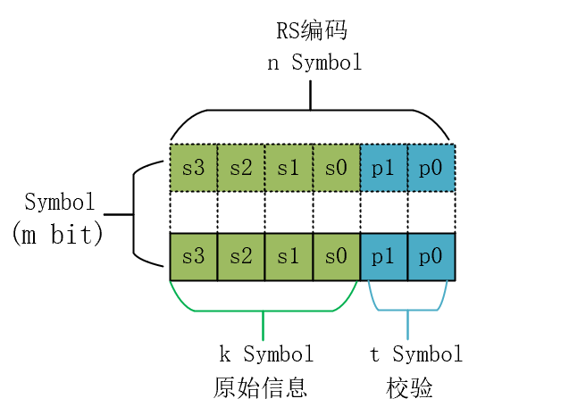
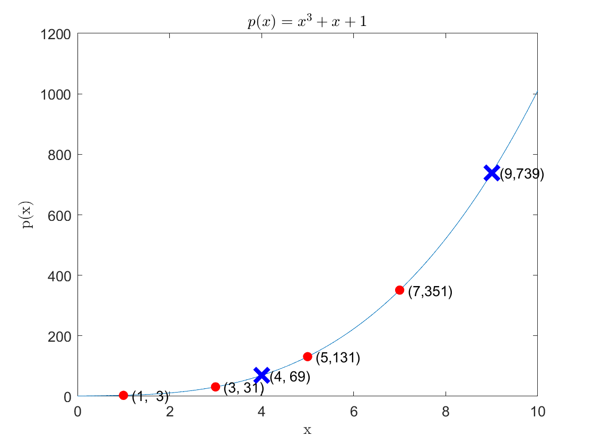

### 前言

里德-所罗门码（Reed-solomon codes，简称里所码或RS codes），是一种信道编码，也叫差错控制编码，是1960年由Iring Reed和Gus Solomon首先构造出来的一种BCH码，这一编码技术广泛应用在光通信、存储系统数据纠错等场景，本文将通过一些具体的例子，简单介绍里德-所罗门码的编码原理。

### 检错纠错的原理

信道编码的基本原理是通过在原始数据字上增加冗余信息来达到检错纠错的目的，对于里德-所罗门码，其通常可以表示为 $RS(n,k)$，其中：

- `n`表示一个码块添加冗余信息后的的码元数
- `k` 表示原始数据中的码元数，亦是编码后码块中的信息码元数
- 一个码块中的校验码元数为`n-k`,记为`t`,亦是编码中需要添加的冗余信息的码元数

 其中每一个码元都是`m`比特数据，RS码是在伽罗华域进行四则运算的，对于码元是`m`比特数据的情况，其伽罗华域的表示即为 $GF(2^m)$，有关伽罗华域的内容将在下文介绍。

假设信息字码元数 $k=4$, 总码元数 $n=6$，进行RS(6,4)，其相关符号的定义如图1所示。由图可见，RS编码是一种系统码（systematic code），其校验位和信息位是分离的，在传输编码的同时也传输了原始信息。

图1. RS编码示意图

RS编码是基于多项式表达的差错控制码，下面将通过简单的例子描述如何在多项式表达中添加冗余信息。注意，**实际上Reed-solomon码是系统码，计算基于伽罗华域，而以下讲解的例子中，并不是系统码，且为了方便理解，计算基于实数域，但其与Reed-solomon有相似的编码思路**。

对于一个二进制数据，可以将其表示为多项式, 与上文一致，同样假设信息位数 $k=4$, 编码总位数 $n=6$，对于二进制`k`位数据`1011`，其多项式表示为(1)式，是一个`k-1`阶多项式。

$$\begin{align}
p(x)&=c_3x^3+c_2x^2+c_1x+c_0 \\
&=x^3+x+1
\end{align} \tag{1}$$

通过MATLAB绘图， $p(x)$的函数曲线如图2所示，对于这一个`k-1`阶多项式，只需要确定`k`个点即可恢复曲线 $p(x)$，例如将图2中的所有红色圆点的坐标 $(x,y)$ 代入多项式构成的方程 $y=c_3x^3+c_2x^2+c_1x+c_0$，即可解得 $c_0=1$, $c_1=1$, $c_2=0$, $c_3=1$，即恢复出原始的二进制数据。若编码器、解码器双方都确定了多项式的`x`坐标点，那么在传送消息时，只需要发送`3`、`31`、`131`、`351`这四个数据，解码方即可恢复出多项式 $p(x)$。若数据传输过程中出现错误，那么解码器将会得到错误的多项式 $p(x)$。

为了实现差错检测与纠正，一个直观的方法就是多传送数据(增加冗余)，这也就是信道编码的基本思路。在上面的例子中，可以对 $p(x)$曲线进行"过采样"，额外采集图2中的蓝色“X”点坐标数据，则需要传送的数据序列从`k`个数据 $\{ 3,31,131,351 \}$，在增加冗余后变成`n`个数据 $\{ 3,31,131,351,69,793 \}$, 增加了`n-k`个冗余信息。为了后文方便讨论，假设这个增加冗余后的数据为 $y(x) = \{ y_1,y_2,y_3,y_4,y_5,y_6  \}$。

  

图2. 多项式曲线及数据点示例

同样地，假设编解码双方已知`x`坐标，在这个例子中这一个`x`坐标为 $\{ 1,3,5,7,4,9 \}$。考虑通信过程中的误差，解码器接收到的数据 $y'(x) \neq y(x)$，假设  $y'(x) =\{ 1,31,131,351,69,793 \}$，即第一个数据出现了差错，解码器将得到的 $y'(x) $每`k`个作为一组，构建`k`个方程，并解方程，以得到多项式 $p(x)$的`k`个系数 $c_{k-}$  ...  $c_0$ 。当有小于 $\frac{n-k}{2}$个差错出现时，解码器仍能够通过其他的未出错数据来恢复出原始多项式 $p(x)$， 这便是基本的基于多项式的冗余增加及纠错的原理。

### Reed-solomon码编码原理

Reed-solomon码使用多项式 $p(x)$的系数 $c_i$来表示信息字，对于 $RS(n,k)$，信息字有`k`个符号，RS码编码后得到`n`个符号。

要产生Reed-solomon码，首先要依据`k`个码元的信息字构建`k-1`阶多项式 $p(x)$，下文为了方便叙述，将这一多项式称为信息多项式。

$$p(x) = \sum_{n=0}^{k-1}c_nx^n \tag{2}$$

定义一个`n-k`阶的生成多项式 $g (x)$，其表达式如(3)，易知 $g(x)$有`n-k`个不重合的根，这一数量正好是添加的冗余符号位。

$$g(x)=\sum_{j=0}^{n-k-1}(x-x_j) \tag{3}$$

**注：在RS编解码过程中**， **生成多项式** $g(x)$ **的`n-k`个不重合的根是编解码双方事先约定好的，编解码双方共用一套生成多项式的根。**

实际上在上述过程中，信息多项式就是原始数据，而生成多项式是固定的，所以以上过程不占用计算资源，计算在生成多项式 $g(x)$和信息多项式"构建"完成后，开始真正进行RS编码运算，其编码过程如下：

1. 将信息多项式 $p(x)$乘上 $x^{n-k}$，这里`n-k`正好是添加的冗余符号的数量，这一操作实际上是移位操作，无需额外硬件资源。
2. 进行多项式除法 $\frac{p(x)x^{n-k}}{g(x)}$，并将其除法的商(quotient)记为 $q(x)$, 将余数(remainder)记为 $r(x)$,由此可以得到（4）式。

$$p(x)x^{n-k}=q(x)g(x)+r(x) \tag{4}$$

将(4)式中得到的 `n-1`阶多项式 $q(x)g(x)$定义为一个新的表达 $s(x)$，即有：

$$s(x)=q(x)g(x)=p(x)x^{n-k}-r(x) \tag{5}$$

信息多项式 $p(x)$是`k-1`阶的，如(6)式所示：

$$p(x) = c_{k-1}x^{k-1}+...+c_0 \tag{6}$$

则 $p(x)x^{n-k}$是`n-1`阶的，且其最低位可能出现的非零系数是 $x^{n-k}$的系数，如(7)所示：

$$p(x)x^{n-k}=c_{k-1}x^{n-1}+...+c_0x^{n-k}+0x^{n-k-1}+...+0 \tag{7}$$

由多项式除法的性质，余数 $r(x)$的阶数应不超过除数 $g(x)$的阶数`n-k`，故 $r(x)$的最高阶次为 `n-k-1`，即有(8)式：

$$r(x)= r_{n-k-1}x^{n-k-1}+r_{n-k}x^{n-k}+...+r_0 \tag{8}$$

结合(7)、(8)两式，代入(5)式，有(9)式：

$$s(x)=c_{k-1}x^{n-1}+...+c_0x^{n-k}+(-r_{n-k-1})x^{n-k-1}+...-r_0 \tag{9}$$

从(9)式可见，多项式 $s(x)$对应的二进制信息数据为 $m_s=(c_{k-1},c_{k-2},...,c_0,-r_{n-k-1},...,-r_0)$，而信息多项式 $p(x)$携带的信息数据为 $m_p=(c_{k-1},c_{k-2},...,c_0)$，即 $s(x)$阶数最高的`k`个系数和信息多项式 $p(x)$的`k`个系数保持一致，即 $s(x)$**可以携带原本需要传送的信息**。

由(5)式中间的部分，结合(3)式，可得 $s(x)$的另一种表达，得到(10)式：

$$s(x)=q(x)g(x)=q(x)\sum_{j=0}^{n-k-1}(x-x_j) \tag{10}$$

由(10)式可知，生成多项式 $g(x)$的根也是 $s(x)$的根，也就是说，将编解码双方事先约定好的 $x_j$代入 $s(x)$，必有 $s(x_j)=0$，**利用这一特点可以进行差错检测**，即当解码方检测到$s(x_j) \neq 0$时，说明收到的数据有误。

综上， `n-1`阶多项式 $s(x)$既可以携带原始信息，又可用来进行差错检测，同时，其携带的信息是多项式的高阶系数，满足系统码的性质，Reed-solomon码的多项式表达正是 $s(x)$。

### Reed-solomon码编解码示例

#### 编码示例

假设有一个`k=4`的信息符号为 $(1,0,1,1)$ ,使用 $RS(6,4)$对其进行信道编码，假设生成多项式的两个根为1、2，则生成多项式为 $g(x)=(x-1)(x-2)=x^2-3x+2$。

- 将信息符号转换为信息多项式 $p(x)=c_3x^3+c_2x^2+c_1x+c_0$
- 将 $p(x)x^2$除以 $g(x)$, 有(11)所示的关系，其中等式右边三个括号从左到右分别是生成多项式 $g(x)$、商 $q(x)$、余数 $r(x)$。

$$x^5+x^3+x^2=(x^2-3x+2)(x^3+3x^2+8x+19)+(41x-38) \tag{11}$$

- 得到 $s(x)=p(x)x^2-r(x)=x^5+x^3+x^2-41x+38$，即RS编码后传送的符号为 $(1,0,1,1,-41,38)$

#### 解码示例

假设解码器接收到的符号为 $s'(x)$，当信息传输过程中不出错时，即 $s'(x)=s(x)$，此时，将生成多项式的两个根代入 $s'(x)$，有 $s'(x)=0$，对于传输出错， $s'(x) \neq s(x)$的情况，由编码理论可知，2位冗余位最多纠正1位错误。假设接收到的符号为 $(1,1,1,1,-41,38)$，一个简单的解码示例如下：

- 将编码符号转换为编码多项式 $s'(x)=x^5+x^4+x^3+x^2-41x+38$
- 将生成多项式 $g(x)$的两个根 $x_0=1$,  $x_1=2$代入到 $s'(x)$，可以得到 $s'(x_0) \neq 0$、 $s'(x_1) \neq 0$，说明传输有误。
- 假设 $c_5$有误，令其为待求解变量，有 $s'(x)=c_5x^5+x^4+x^3+x^2-41x+38$，令 $s'(1)=0$，解得 $c_1=0$, 令 $s'(0)=1$，解得 $c_1=\frac{1}{2}$, 两者冲突，故判定 $c_5$无错误。
- 假设 $c_4$有误，令其为待求解变量，有 $s'(x)=x^5+c_4x^4+x^3+x^2-41x+38$，令 $s'(1)=0$，解得 $c_4=0$, 令 $s'(0)=1$，解得 $c_4=0$, 两者一致，故判定 $c_4$出现错误，其值应该为0。
- 由于已经纠正一个差错，停止遍历其他参数，故纠正后的编码为 $(1,0,1,1,-41,38)$。

注意这一方法只是RS码解码方案中的一种，实际上还有许多的RS解码算法。

### 伽罗华域

以上所述的所有运算都是在实数域进行的，实际上，Reed-solomon码的运算是基于伽罗华域(Galois Fields，GF)的，伽罗华域亦称为有限域，顾名思义，它是一种有限的元素构成的数字域，其进行四则运算的结果是被限制在一定范围内，有限域最常见的例子是当 $p$为素数时，整数对 $p$取模，这样的伽罗华域记为 $GF(p)$。

#### 伽罗华域中的四则运算

伽罗华域中的加法定义如下：

$$(a+b)_{GF(p)}=(a+b)\ \  mod \ \  p \tag{12}$$

伽罗华域中的乘法定义如下：

$$(a \ times b)_{GF(p)}=(a \times b)\ \  mod \ \  p \tag{13}$$

以 $GF(7)$为例，在这一伽罗华域中，只有0-6的数字存在，其他的数字都会进行”模7“运算，对于加法 $5 + 6$，在伽罗华域中的计算结果为 $(5+6) = (5+6)  mod  7 =4 $。对于乘法 $5 \times 6$，在伽罗华域中的计算结果为 $(5 \times 6)=(5 \times 6)\ \  mod \ \  7 =2 \$。

对于减法，需要定义"逆元"，在实数域， $2+(-2)=0$, 则可以称 `-2`是`2`的”加法逆元“，在 $GF(7)$中， $(1+6)_{GF(7)}=0$，故称1和6互为加法逆元。

伽罗华域中的减法定义如下，与实数域类似，减法就是加上”加法逆元“。

$$(a-b)_{GF(p)}=(a+(-b))\ \  mod \ \  p \tag{14}$$

以 $GF(7)$为例，对于减法 $5-6$，在伽罗华域中的计算结果为 $(5-6)_{GF(7)} = (5+1)\ \  mod \ \  7 =6 \$。

对于除法，需要定义"乘法逆元"，在实数域， $1 \times (-1)=1$, 则可以称 `-1`是`1`的”乘法逆元“，在 $GF(7)$中， $(3 \times 5)_{GF(7)}=1$，故称3和5互为乘法逆元。

伽罗华域中的除法定义如下，与实数域类似，除法就是乘以”除法逆元“。

$$(a \div b)_{GF(p)}=(a \times (b)^{-1})\ \  mod \ \  p \tag{15}$$

对于伽罗华域中的多项式运算，实际上就是一种四则运算的组合，依据上文所述的四则运算法则，将多项式系数都看作是 $GF(7)$中的数，即可得到伽罗华域中的多项式运算法则，例如对于一个 $GF(7)$中的多项式 $p(x) = (x+(-3))^2$，其满足(16)式中的关系：

$$(x+(-3))^2= x^2+(-6)x+9=x^2+x+2\tag{16}$$
#### 伽罗华域的扩展

在现实世界中，数字信息都是以二进制比特流表达的，在这种表达中，只有高电平(1)和低电平(0)两种数字表述，在一定程度上，这也是一种“有限域”，即 $GF(2)$，它里面只有2个元素{0,1}，在这一计算域中， 四则运算规则与式(12)-(15)式一致。

$GF(2)$的加法、乘法操作的运算表如表1所示，可见加法运算与数字电路逻辑运算中的“异或”等价，乘法运算与数字电路逻辑运算中的“与”等价，这使得 $GF(2)$的运算适合于电路实现。

表1. 有限域GF(2)中的加法操作和乘法操作运算表

<table>
    <tr>
        <th colspan="2">乘法</th>
        <th colspan="2">加法</th>
        <th rowspan="2">积</th>
        <th rowspan="2">和</th>        
    </tr>
    <tr>
        <th>被乘数</th>
        <th>乘数</th>
        <th>被加数</th>
        <th>加数</th>        
    </tr>
        <tr>
        <th>0</th>
        <th>0</th>
        <th>0</th>
        <th>0</th>   
        <th>0</th>
        <th>0</th> 
    </tr>
        </tr>
        <tr>
        <th>0</th>
        <th>1</th>
        <th>0</th>
        <th>1</th>   
        <th>0</th>
        <th>1</th> 
    </tr>
    </tr>
        </tr>
        <tr>
        <th>1</th>
        <th>0</th>
        <th>1</th>
        <th>0</th>   
        <th>0</th>
        <th>1</th> 
    </tr>
    </tr>
        </tr>
        <tr>
        <th>1</th>
        <th>1</th>
        <th>1</th>
        <th>1</th>   
        <th>1</th>
        <th>0</th> 
    </tr>
</table>

在 $GF(2)$中 `1`的乘法逆元就是`1 `本身， `0`没有乘法逆元。使用 $GF(2)$中的元素作为多项书系数，定义多项式如(17)式：

$$c_nx^n+...+c_1x+c_0 \ \ c_i \in GF(2) \tag{17}$$

(17)式中多项式系数 $c_i$的四则运算是遵循 $GF(2)$的四则运算规则的, 例如多项式的加法的一个例子如(18)式，这一式子能成立是因为在 $GF(2)$中，有 $1+1=0$，这也就表明在GF(2)中相同的多项式相加为0，即多项式的“加法逆元”是自己本身。

$$(x^2+x+1)+(x^2+1)=1 \tag{18}$$

同样地，多项式的乘法仍然是通过乘法的分配率展开多项式，在 $GF(2)$中的一个多项式的乘法的例子如(19)所示：

$$(x+1)^2=x(x+1)+(x+1)=x^2+x+x+1=x+1 \tag{19}$$

通过以上例子可知，虽然 $GF(2)$的元素只有有限个，但由 $GF(2)$构成的多项式的二进制表达可以有无限多个，因为构成的多项式系数个数并无限制。

若将伽罗华域 $GF(p)$对于普通数据元素 (如 $GF(2)$中的`1`和`0`)四则运算的思想(运算后对`p`求模 )运用到多项式计算领域，那么就得到了扩展的伽罗华域 $GF(p^w)$。其中 `w-1`代表 $GF(p^w)$所能表达的多项式的最高阶次。以 $GF(2^2)$为例，其构成的多项式有 $0$、$1$、$x$、$x+1$，其对应的系数表达的二进制数分别是 `00`、 `01`、 `10`、 `11`。

在描述$GF(p)$扩展为 $GF(p^w)$的方法前，需要引出本原多项式(Primitive polynomial)的概念，简单来说这一多项式就是不可分解的多项式, 例如 $x^2+1$ 就是在实数域下的本原多项式, 它无法分解成2个多项式乘积。对于将伽罗华域$GF(p)$扩展为 $GF(p^w)$的过程，本原多项式与幂次项 $w$有关，不同的 $w$对应不同的 $w$阶本原多项式，常用的本原多项式可以通过查询得到。

假设 $p(x)$是 $GF(2^w)$上的一个本原多项式， $GF(2^w)$元素产生的过程如下：。

1. 给定初始多项式集合，包含 $0$、 $1$和 $x$，即 ${0，1，x}$。
2. 将集合 ${0，1，x}$中最右边的 $x$乘以 $x$，若得到的新的多项式 $n(x)$的最高次幂大于等于 $w$，则将这一新的多项式 $n(x)$ 对本原多项式 $p(x)$取模，即有 $n'(x) = n(x) \ \ mod p(x)$，$n(x)$的最高次小于 $w$，则不进行取模操作，有 $n'(x) = n(x)$，并将 $n'(x)$加入到集合最右方。
3. 重复1与2操作，直到集合中有 $2^w$个元素。

以 $GF(2^3)$的域扩展过程为例，通过查表可以选择 $w=3$时的本原多项式为 $p(x)=x^3+x+1$， $GF(2^3)$域中含有8个元素，除了`0`、`1`外，另外的6个元素都需要通过本原多项式产生。

其产生过程的示意如表2所示，表中展示了生成 $GF(2^3)$中元素的过程，可见，$GF(2^3)$中有2^3个独立的元素，这些元素都是以多项式或者二进制的形式来表示的。

计算机领域中经常使用的是 $GF(2^8)$，8刚好是一个字节的比特数。为了保证单位元性质， $GF(2^w)$上的加法运算和乘法运算，不再使用一般的加法和乘法，而是使用多项式运算。

#### 伽罗华域查表运算原理

伽罗华域 $GF(2^w)$是基于 $GF(2)$进行扩展得到的，其加法和乘法计算分别可以使用”异或“以及”与“进行计算，运算开销小。但多项式乘法、除法运算，其结果需要 mod $P(x)$，这一运算相对复杂。为了减少运算，常用”查表“的方法来进行多项式”运算“。

在介绍查表法前，先提出一个概念，即”生成元”，生成元是域上的一类特殊元素，生成元的幂可以遍历域上的所有非零元素。假设 $g$是伽罗华域 $GF(2^w)$上的生成元，则 $GF(2^w)$上的所有非零元素都可以多项式生成元 $g$通过幂求得。 即有限域中的非零元素 $e$都可以表示为 $e = g^k$。 由于 $GF(2^w)$是有限域，而 $k$可以无限多，故存在循环，即 $g^k=g^{k \mod (2^w -1)}$。

对于乘法 $a=g^n$,  $b=g^m$，则有 $a \times b = g^{(m+n)}$，查找表的原理就是假定生成元 $g$已经确定，依据 $a$的值，确定 $n$，依据 $b$的值，确定 $m$，然后查找 $g^{(m+n)}$即可得到计算结果。

为了计算 $GF(2^w)$中的多项式表示的乘除法，需要将多项式先转换为多项式元素索引，然后多项式元素加减，得到新的GF(2)中的元素的索引，最后将加减后的多项式元素索引结果再转换为 $GF(2^3)$中的多项式。两次转换分别代表两次查表过程，为此，需要构造两个映射表，分别记为gf和gfi，其中gf是将 $GF(2^w)$中的二进制形式(多项式形式)映射为多项式索引形式，gfi是将多项式索引形式映射为二进制形式。

以上文表2中的编码过程为例，结合表2， $gf$、 $gfi$查找表如表3所示。

表3. GF(2^3)的多项式运算查找表

| i      | 0    | 1    | 2    | 3    | 4    | 5    | 6    | 7    |
| ------ | ---- | ---- | ---- | ---- | ---- | ---- | ---- | ---- |
| gf[i]  | -    | 0    | 1    | 3    | 2    | 6    | 4    | 5    |
| gfi[i] | 1    | 2    | 4    | 3    | 6    | 7    | 5    | -    |

以  $GF(2^3)$中的多项式乘法运算 $4 \times 5$为例，首先若不使用查表法，依据表2结果， $4$对应的多项式为 $x^2$， $5$对应的多项式为 $x^2 +1$，则乘法运算 $4 \times 5$其实就是(20)式中的多项式运算

 $$x^2(x^2+1) =  (x^4 + x^2) \mod g(x) = x \tag{20}$$

最终的多项式乘法运算的结果以多项式表达为 $x$，用十进制表达即为2。

现在改用查表法，则其计算过程变为(21)式：

$$4 \times 5 = gfi[gf[4]+gf[5]] =  gfi[(2+6) \mod 7] = gfi[1] = 2 \tag{21}$$

最后计算的结果也是2，这就是使用查表法进行运算的一个例子，此过程中实质上只有一个加法运算这减少了编码器的电路资源开销。对于除法进行查找表也是同样的原理，只是加号变成减号，在此不再进行赘述。

至此，有关Reed-solomon码中所用到的伽罗华域的内容已经解释完毕，在前面章节介绍Reed-solomon码编码过程时，相关计算都是在实数域进行的，只要将其多项式计算转移到伽罗华域 $GF(2^w)$进行，即成为现今常用的里德所罗门码。

### RS编码器的电路实现

基于前文的数学原理分析，尤其是

